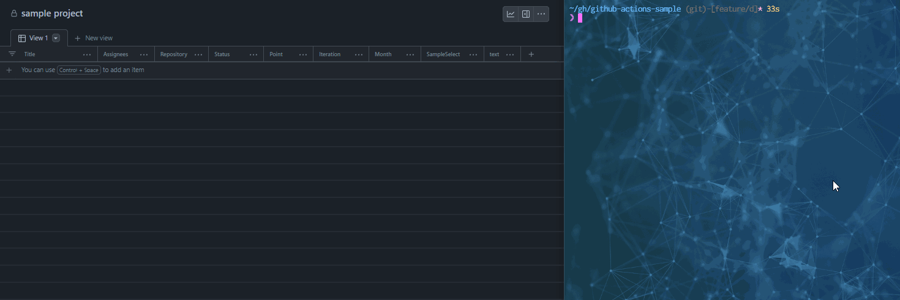

# gh-ap

add Issue or Pull Request to Project(v2)

## Usage

```bash
gh ap
```

### Optional Args

```bash
gh ap --help
  -issue int
        Issue Number
  -pr int
        PullRequest Number
```

- Specified Issue Number(Optional)

```bash
gh ap -issue ${issueNumber}
```

- Specified PullRequest Number(Optional)

```bash
gh ap -pr ${pullRequestNumber}
```

## Demo



## Requirement

require `project` permission

If you do not have Project permission, please use the following command to add the scope

```bash
gh auth login --scopes 'project'
```

## Feature
- Add Issue or PullRequest to GitHub ProjectV2
  - Current branch Pull Request
  - PullRequest
  - Issue
- Custom Field Update

## install

```shell
gh extension install swfz/gh-ap
```

We will update it in an interactive format.
