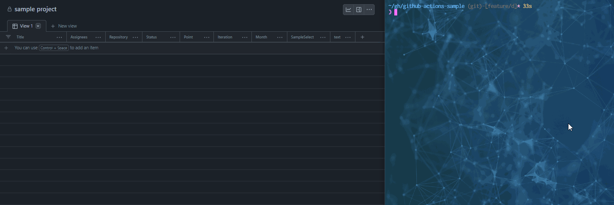

# gh-ap

add Issue or Pull Request to Project(v2)

## Usage

```bash
gh ap
```

### Optional Args

```bash
gh ap --help
  -field value
        Field value in 'FieldName=Value' format (can be specified multiple times)
  -issue int
        Issue Number
  -pr int
        PullRequest Number
```

- Specified Issue Number(Optional)

```bash
gh ap -issue ${issueNumber}
```

- Specified PullRequest Number(Optional)

```bash
gh ap -pr ${pullRequestNumber}
```

- Specified Field Values(Optional)

Set custom field values directly without interactive prompts. Can be specified multiple times for multiple fields.

```bash
gh ap -issue 123 -field "Status=Done" -field "Priority=High"
```

Supported field types: Text, Date(`YYYY-MM-DD`), Number, Single Select, Iteration

## Demo



## Requirement

require `project` permission

If you do not have Project permission, please use the following command to add the scope

```bash
gh auth login --scopes 'project'
```

## Feature
- Add Issue or PullRequest to GitHub ProjectV2
  - Current branch Pull Request
  - PullRequest
  - Issue
- Custom Field Update

## install

```shell
gh extension install swfz/gh-ap
```

We will update it in an interactive format.
